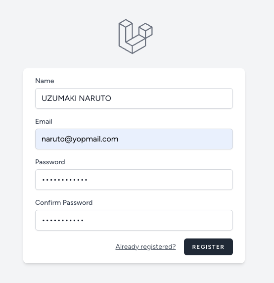
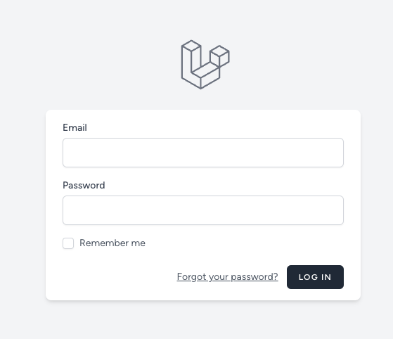
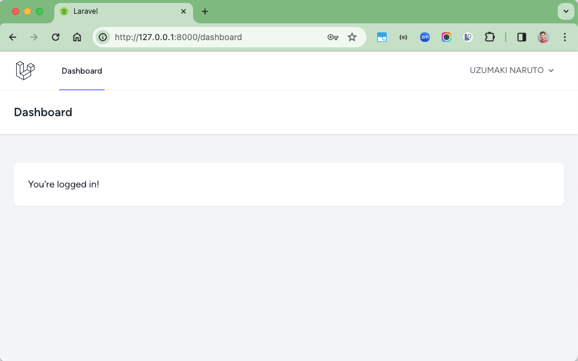
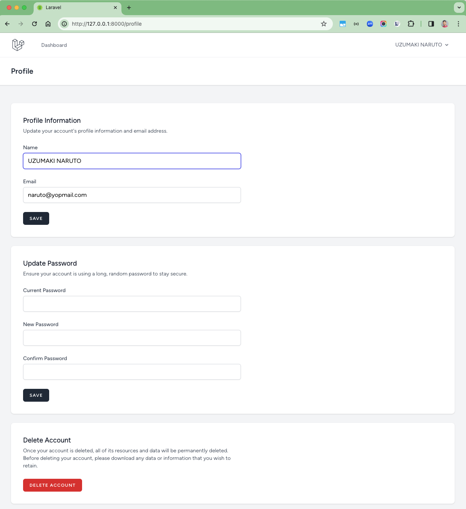
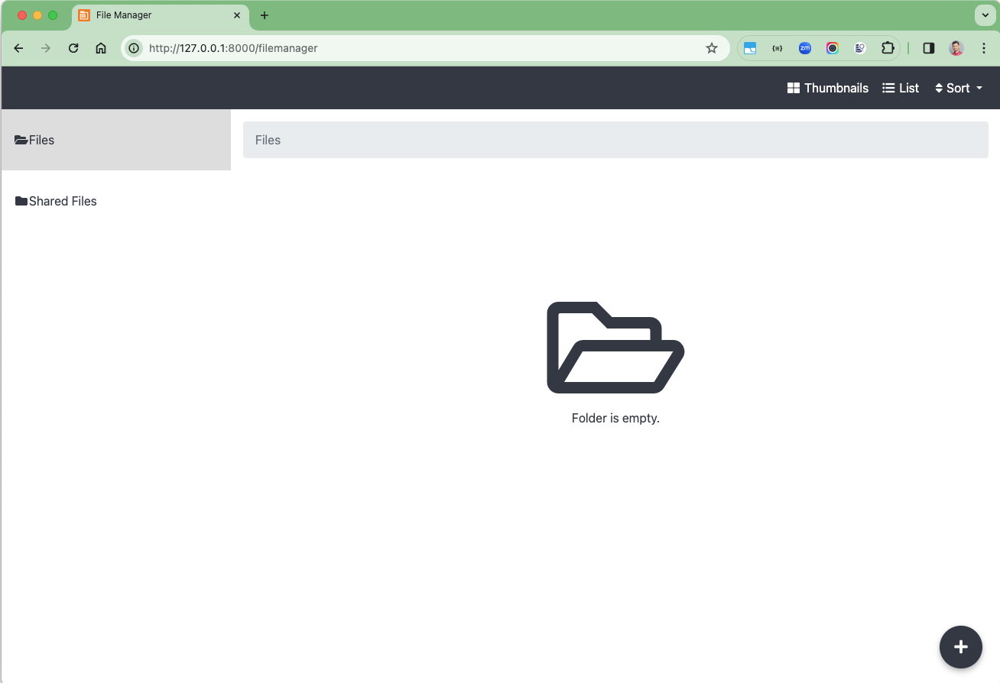
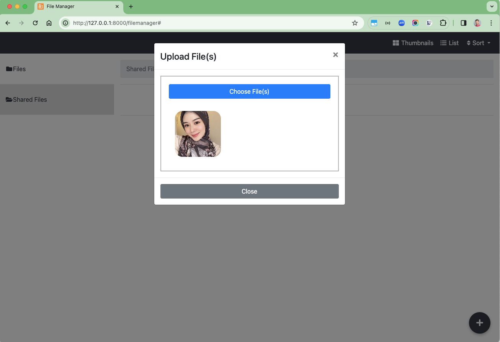

# Laravel 10 Breeze and File Manager

This is an implementation of Laravel Breeze & File Manager.

Clone the repository:

```shell
git clone https://github.com/hendisantika/laravel-breeze.git
cd laravel-breeze
```

## Installation

### Composer Packages

```
composer install
```

## Configuration

### Create `.env` file from `.env.example`

```
cp .env.example .env
```

### Generate Laravel App Key

```
php artisan key:generate
```

### Database Integration

1. Open `.env` file
2. Create a database and connect it with Laravel with filling the DB name in `DB_DATABASE` key
3. Adjust the `DB_USERNAME`
4. Adjust the `DB_PASSWORD`

### Migrate the Database Migration and Run the Seeder

```
php artisan migrate
```

## Run App

Install NPM packages first

```
npm install
```

Open new console and run the app with Vite

```
npm run dev
```

Run local web server

```
php artisan serve
```

### Image Screen shot

Register Page



Login Page



Dashboard Page



Profile Page



File Manager Page



Upload File



